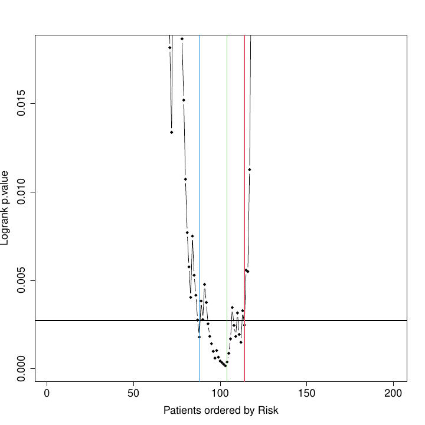
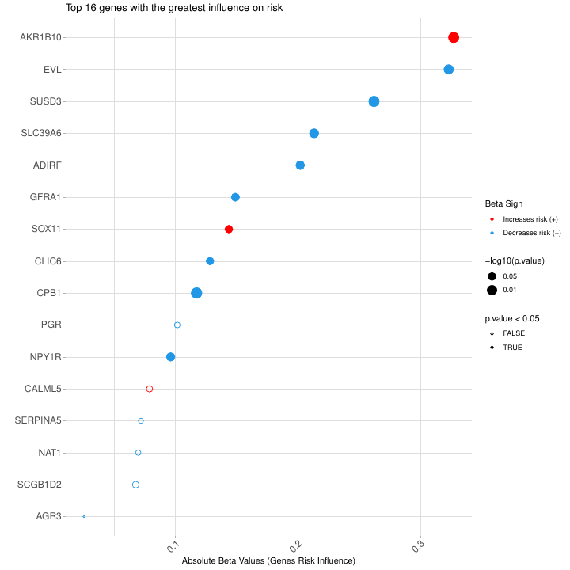

```{r setup, include=FALSE}
library(formatR)
library(knitr)
library(asuri)
knitr::opts_chunk$set(tidy.opts = list(width.cutoff = 65), tidy = TRUE, 
                      echo = TRUE, message = FALSE, warning = FALSE, results = "hide")
```

# Introduction

Here we present a new algorithm called **ASURI** that provides an integrated set of functions to analyse disease **SURVIVAL** and obtain patient **RISK** predictions based on gene activity signatures. Specifically, the algorithm is designed to: (1) Analyse the ability of a given gene to mark disease prognosis and survival based on gene expression or other gene-related activity signal; (2) Discover gene markers by identifying the significant association of gene expression (or other gene-related signal) with a clinical variable or phenotypic trait; (3) Constructing robust patient risk predictors based on selected gene signatures using univariate and multivariate approaches; (4) Predicting the risk of new query patients based on their gene expression profile and classifying the patients into a risk group (high/intermediate/low); (5) Estimating a survival curve for new query patients.  

In accordance with the 5 utilities of the package described above, **ASURI** is built with five R functions specific to each of these uses (**Figure \@ref(fig:diagramaCrop)**): (1) **geneSurv()**, that implements a robust method to evaluate the ability of a given gene to mark survival based on its expression level. It is based on a bootstrapped version of the Kaplan-Meier estimator and the long-rank statistics provided by [@survival-package]. This function helps to overcome the instability and irreproducibility of other tools developed for this purpose [@aguirre2013survexpress]. (2) **genePheno()**, which implements a robust method to select a subset of genes whose expression is correlated with a clinical variable or phenotypic parameter. This function is based on the Elastic Net algorithm proposed by [@glmnet; @simon2011regularization], which removes features that are not-relevant to the prediction the clinical variable. To improve the stability and reproducibility of the list of genes associated with a phenotype, the method implements a bootstrap strategy. The function provides several metrics that are useful to evaluate the stability and relevance of each gene. This function is particularly useful for clinicians who want to discover survival biomarkers that interact with clinical variables or parameters relevant to patient treatment.

```{r diagramaCrop, fig.cap="Workflow diagram of the package ASURI showing the decision-making lines and the five main functions.", out.width = "100%", fig.align = "center", echo=FALSE, results="asis"}

```

Next function, (3) **patientRisk()**, which accurately predicts the patient risk given a set of informative genes, provided as an input list of selected genes. The function is based on the multivariate UNICOX model proposed by [@tibshirani2009univariate]. The function provides as output the list of selected genes ranked according to their impact on patient risk along with a relevance index. It also provides a risk prediction for each one of the patients included in the training considering the gene signature obtained and an optimal stratification into two or three risk groups (i.e., poor, intermediate and good prognosis). (4) **predict.patientRisk()**, which predicts the risk for new, novel patients based on the model and the gene signature produced by the **patientRisk()** function over the training set. This function also classifies the patients in two or three risk groups. (5) **predSurvCurve()**, which estimates the survival curve for any given query patient using the patient's gene expression profile. These 5 functions included in ASURI also provide graphical output plots to help visualize and analyze survival and patient risk; and, as indicated, they are designed to work with one or more genes (i.e., features), that is, to analyze univariate and multivariate gene signatures.


# Package download and installation. Package dependencies.

The ASURI package can be installed directly from Bioconductor typing the following commands in an R:

if (!requireNamespace("BiocManager", quietly = TRUE)) {
    install.packages("BiocManager")
}

BiocManager::install("ASURI")

It can be installed also from a local directory if you have downloaded previously the package.

install.packages("/path/to/ASURI.tar.gz", dependencies = TRUE)
library(ASURI)

If a problem with dependencies is reported during installation, users should first download the missing R packages directly from [CRAN](https://cran.r-project.org/) R repository or from [Bioconductor](https://bioconductor.org/) repository, and then repeat previous instructions to install ASURI R package. In Windows based OS, [Rtools](https://cran.r-project.org/bin/windows/Rtools/) might need to be installed. Some of the package dependencies of ASURI are the following, from **CRAN**: ‘ggplot2’, ‘glmnet’, ‘Rdpack’, ‘ROCR’, ‘scales’; and from **Bioconductor**: ‘Biobase’, ‘siggenes’, ‘survcomp’. The ASURI package also contains an experimental dataset to illustrate the performance of the various functions and methods implemented in it.

# Dataset description and download.

The dataset included in ASURI as a study case is intended to facilitate the use of the package. The dataset was obtained from several GSE series from [GEO database](http://www.ncbi.nlm.nih.gov/geo/) corresponding to breast cancer (BRCC) samples, where expression and survival time were reported [@Bueno2023]. Each sample corresponds to genome-wide expression profiles of BRCC primary tumor samples hybridized on the transcriptomic platform: *Affymetrix* *HGU133 Plus2.0*; which is a high-density microarray expression platform containing 594,000 oligo-nucleotide probes (organized in probe-sets) that we mapped to ENSEMBL genes using the *hgu133plus2hsensgcdf* CDF package, obtained from [BRAINARRAY](http://mbni.org/customcdf/24.0.0/ensg.download/hgu133plus2hsensgcdf_24.0.0.tar.gz). The expression signal of the samples was normalized using fRMA [@fRMA] or RMA [@RMA] and Combat [@combat], as described in [@Bueno2023]. Clinical variables and information about the tumors were collected and included in the phenodata object. More specifically, the information about the expression level of 3 key BRCC biomarkers (i.e. **ER** / ESR1, **PR** / PGR, and **HER2** / ERBB2 protein-coding genes) was included in the phenodata when available.

Once this dataset is downloaded two objects are created: *mExprs*, that is the normalized gene expression data matrix; and *mPheno* that includes information about each sample (i.e. clinical physio-pathological data and other phenotypic data).

```{r} 
data(mExprs)
# To visualize the dimensions of the ExpressionSet object
dim(mExprs)
```

```{r} 
data(mPheno)
# To visualize the dimensions of the phenotypic information object
dim(mPheno)
```

# Platforms supported by the library and preprocessing.

The library supports expression data matrices coming from high-density microarrays (such as the example data set described above), as well as expression data matrices coming from RNA-seq platforms. However, it can be applied to any omic technology that provides a gene-related activity signal. 

For the transcriptomic / gene expression data, it is recommended to transform the gene signal using the $log_2$ function and to standardize the expression values, for example by calculating a z-score. For microarray data, it is recommended to perform a robust normalization of the raw signal before running *COX regression methods*. In addition, for the microarray datasets, the gene expression signals are calculated using the **RMA** method [@RMA; @fRMA] or the **normalizeBetweenArrays** method from [@ritchie2015limma] (both work well within the ASURI package). For RNA-seq datasets, the data matrix of counts per gene can be used, and we recommend applying a normalization method such as the Voom method, considered in [@scarfo2016identification].

# Survival and risk assessment (case study on Breast Cancer).

In this section, we present and explain the use of the **ASURI** library, including the five main functions described above, by applying the package to the example breast cancer dataset (which contains 200 samples and 20,049 genes). The different parts of this main section show the different analyses that can be performed with the package.

## Analysis of individual genes as survival markers: **geneSurv()** 

The first goal of the **ASURI** algorithm is to identify human genes measured in biological samples from patients (e.g., measured in tumor samples from cancer patients) that are associated with the survival of the individuals (i.e., with the prognosis). To do this, the algorithm examines the expression (or activity) of the query genes in a cohort of samples from patients with the same disease, and divides such a cohort into samples with high expression of a query gene and samples with low expression of such query gene. In this way, the algorithm splits the cohort into two groups and then runs a Kaplan-Meier (K-M) analysis for each of these two groups of samples, determining whether such K-M show a significant difference based on the log-rank statistic. All of this is implemented in the **geneSurv()** function [@Bueno2023]. This statistic evaluates the separability between the survival curves of the groups obtained by a gene expression (or gene activity) threshold, which will be: samples with high expression versus samples with low expression of the query gene. The naive approach introduced in other tools, such as [@aguirre2013survexpress], estimates the two groups of samples just splitting the cohort using the mean or median of the gene activity, and then trying to obtain the best p-value of the log-rank statistic for the KM of the two groups. This strategy often yields meaningless solutions, giving rise to highly unbalanced groups. To overcome these problems, the **geneSurv()** function implements an original method that uses bootstrapping to compute the optimal threshold and focuses the split only on the central 60% of the samples, avoiding very unbalanced groups.

As described above, to improve the stability and reproducibility of the survival analysis available in other R packages [@kassambara2017package], a bootstrap strategy is implemented in **ASURI**. A membership probability is estimated for the classification of the each patient (each sample) into one of the two risk groups (**Figure \@ref(fig:pclassesr1)**). These membership probabilities allow us to robustly reclassify patients around the gene expression threshold (**Figure \@ref(fig:boxesr1)**). This approach is univariate and does not take into account interactions or correlations between the genes (i.e., it considers each feature gene as independent).

Once the patients are assigned to the two groups by the bootstrap strategy, the function plots robust K-M curves with confidence intervals (**Figure \@ref(fig:kmesr1)**).
 
As an example of use, let's now analyse using the **geneSurv()** function a well known **gene survival marker** in the dataset of breast cancer: the **Estrogen Receptor (ER+, ESR1)**.

The input parameters for the function are the following:

- `geneExpr` Vector with the normalized gene expression for each sample. names(genExpr) should contains the sample names.
- `time` Numeric vector containing the survival time for each sample in years, including the sample name in names(time). 
- `status` Numeric vector with the status (censored 0 and not censored 1) for each sample, names(status) should include the sample names.
- `geneName` A character string with the name of the gene being analyzed.
- `boxplot` A logical value indicating whether to generate a boxplot of gene expression by survival group (by default = TRUE).
- `iter` The number of iterations (bootstrap resampling) for calculating optimal group cutoffs (by default = 100).
- `type` Specifies whether the two Kaplan-Meier curves are computed using the gene expression groups (by default "exprs"), or using the risk groups ("risk") if the samples are already classified by risk level and this is used directly to divide the samples into two groups.
- `cut_time`  A numeric value specifying the cutoff time (in years) for survival analysis. All events beyond this time are treated as censored (by default = 10 years).

```{r, echo = TRUE, results = 'hide', fig.show='hide'} 
data(geneSurvExprs)
genExpr <- mExprs[match("ESR1", rownames(mExprs)), ]
time <- mPheno$time
names(time) <- rownames(mPheno)
status <- mPheno$status
names(status) <- rownames(mPheno)
# The TIME value must be transformed to YEARS
# The gene expression vector must be provided with the NAMES of each sample,
# that should match the time and status NAMES.
set.seed(5)
outputKM <- geneSurv(genExpr, time, status, "ESR1", type = "exprs")
```

The function returns different outputs, i.e., a list with values and plots that is different depending on the specified *type* or *mode* how it is run. 
Run of the function  **geneSurv()** as `type = "exprs"`:

- **geneName**: A character string with the name of the gene being analyzed.
- **patientExpr**: The expression level of the query gene in each sample (i.e., in each patient).
- **patientClass**: Vector of group classification according to the gene expression level: 2 = high expression (HighExpr) and 1 = low expression level (LowExpr).
- **patientClassProbality**: Vector of membership probabilities for the classification.
- **wilcox.pvalue**: The p-value from the Wilcoxon test comparing the two expression groups.
- **plot_values**: A list containing the Kaplan-Meier curve results, the log-rank test p-value, and the hazard ratio.

Also three plots are provided: 

- Plot of the probability (from 0 to 1) of the samples to belong to one of the two groups or classes obtained based on the expression level of the query gene (low expression and high expression) (**Figure \@ref(fig:pclassesr1)**).
- Boxplots showing the expression distributions of the samples divided into the two defined groups (LowExpr versus HighExpr). The plot includes the p.value of the Wilcoxon test comparing these two expression groups (**Figure \@ref(fig:boxesr1)**).
- Kaplan-Meier plot showing the curves calculated based on the survival of the two groups of samples generated (i.e., samples with high expression of the query gene, in red, and samples with low expression of the query gene, in green). The plot includes the p.value of the log-rank statistical test obtained when comparing the K-M survival profile of the two groups (**Figure \@ref(fig:kmesr1)**).

For `type = "risk"`:

- **geneName**: A character string with the name of the gene being analyzed.
- **patientExpr**: The expression level of the query gene in each sample (i.e., in each patient).
- **risk_score_predicted**: A numeric vector of predicted or calculated risk score (in %, in relative numbers) of each patient.
- **plot_values**: A list containing the Kaplan-Meier curve results, the log-rank test p-value, and the hazard ratio.

Also a plot is provided:

- Kaplan-Meier plot showing the curves calculated based on the survival of the two groups of samples generated (high risk and low risk). The plot includes the p.value of the log-rank statistical test obtained when comparing the K-M survival profile of the two groups (**Figure \@ref(fig:kmrisk)**).

```{r pclassesr1, fig.cap="Patient Class Probability for low exprs (89) and high exprs (111) groups).", out.width = "80%", fig.align = "center", echo=FALSE, results="asis"}

```

**Figure \@ref(fig:pclassesr1)** shows the plot of the probability of the samples to be assigned to one of the expression groups: low expression in green or high expression in red. The samples in the example correspond to the tumors isolated from 200 breast cancer patients. The probability of belonging to a group is estimated by bootstrapping. Patients with a membership probability greater than 0.8 are classified with a high degree of confidence. The classification is uncertain (p < 0.8) for patients around the intermediate gene expression level.

```{r boxesr1, fig.cap="Boxplot: high expression vs low expression for ESR1 gene.", out.width = "80%", fig.align = "center", echo=FALSE, results="asis", results="asis"}

```

**Figure \@ref(fig:boxesr1)** boxplots showing the expression distribution of the samples divided into the two defined groups (LowExpr versus HighExpr). The plot includes the p.value of the Wilcoxon test comparing these two expression groups. Notice that there is a small overlapping between the high and low expression groups. This is due to the reassignment of patients with intermediate expression level accomplished by the bootstrap strategy.

```{r kmesr1, fig.cap="Kaplan Meier curves obtained after the assignment of the patients by bootstrap to high or low survival using the selected feature ESR1.", out.width = "80%", fig.align = "center", echo=FALSE, results="asis"}

```

**Figure \@ref(fig:kmesr1)** shows the two Kaplan-Meier curves with the confidence intervals obtained by the function **geneSurv()** for the gene ESR1. The threshold for the gene expression level that splits the samples in two groups is estimated by optimization of the log-rank test statistic. The procedure is repeated 100 times using a bootstrap strategy to improve the classification of intermediate risk patients. 

The result shown in **Figure \@ref(fig:kmesr1)**, with a p-value for the log-rank test (= 0.01695) and an Hazard Ratio (= 1.86: CI (0.31, 3.13) ) suggest that the gene ESR1 is a good survival marker for breast cancer. 

Run of the function  **geneSurv()** as `type = "risk"`:

```{r, echo = TRUE, results = 'hide', fig.show='hide'} 
# If we instead consider to run the function as *type* = risk
data(geneSurvRisk)
genExpr <- mExprs[match("BRCA1", rownames(mExprs)), ]
time <- mPheno$time
names(time) <- rownames(mPheno)
status <- mPheno$status
names(status) <- rownames(mPheno)
set.seed(5)
outputKM.TP53 <- geneSurv(genExpr, time, status, "BRCA1", type = "risk")
```

```{r kmrisk, fig.cap="Kaplan Meier curves obtained after the assignment of the patients by bootstrap to high or low survival using the estimated risk based on feature BRCA1.", out.width = "80%", fig.align = "center", echo=FALSE, results="asis"}

```

**Figure \@ref(fig:kmrisk)** shows the two Kaplan-Meier curves with the confidence intervals obtained by the function **geneSurv()** for the gene BRCA1. Now the two groups are obtained by estimating the risk for each patient and determining the split threshold by optimizing the log-rank test statistic between the two curves. The procedure is repeated 100 times using a bootstrap strategy to improve the classification of intermediate risk patients.

## Discovery of genes associated with phenotypic factors: **genePheno()**
 
It has been suggested in the literature that the clinical features and physiopathological parameters of a patient's disease can be associated with specific biomolecular pathways or genes that can be identified as markers of that patient's condition or status. The **genePheno()** function implements a robust algorithm to obtain a list of genes associated with a given clinical variable or phenotypic factor [@Bueno2023] measured in a cohort of patients. These genes may provide alternative and novel targets to standard known disease markers.

The **genePheno()** function performs a feature selection by fitting a predictor to the given set of samples based on the *Elastic Net* algorithm (proposed by [@glmnet; @simon2011regularization]). This method incorporates a regularization term that lies between the *Lasso* and the *Ridge* regression. Small coefficients are reduced to zero but the predictor can include more relevant variables than the Lasso to improve the prediction accuracy, even though some of them may be slightly correlated. In this way, we avoid the extreme behavior of Lasso, which randomly selects only one of them. Thus, the *Elastic Net* algorithm helps to improve the stability and to reduce the variance in the feature selection process [@tibshirani1996regression]. The optimal value for the regularization parameter is determined automatically by a nested cross-validation strategy. The loss function for the predictor is the AUC (Area Under the ROC Curve), which considers a balance between false positive and false negative errors.

To improve the reproducibility and stability of the list of candidate genes found (i.e., the selected features) found to be significantly correlated with a clinical variable, a **bootstrap** strategy is implemented. Training data are resampled with replacement and an ensemble of gene lists is obtained. A stability metric based on the selection probability is defined. Thus, genes with a low selection probability are robustly filtered out. A final gene list is obtained with two metrics. The first one evaluates the stability and the second one the degree of correlation with the clinical variable. This approach is multivariate and takes into account additive interactions between candidate genes as well as possible correlations. 

Before running **genePheno()**, the number of input features, i.e. the number of tested genes, should be reduced (to no more than a thousand) to improve the computational efficiency of the function. However, this preprocessing step should be done carefully to avoid removing relevant genes. The **ASURI** package provides the function **prefilterSAM()**, which implements a differential expression algorithm called SAM (proposed by [@Tusher24042001; @li2013finding]) to obtain a set of significant genes to be selected. **prefilterSAM()** improves the stability and robustness of SAM by applying a bootstrapping strategy. For each preliminary gene list, the optimal lambda threshold is calculated by repeating the process with different FDR values and selecting the one that minimizes the p-value. The final list contains only those genes that are present in at least 10% of the iterations. This step can be skipped if you have already selected a set of informative genes.

The input parameters for the function are the following:

  - `mExprs`: A data matrix where the rows are the genes and the columns are the samples. Thus, each entry is the expression value of a gene in a sample.
  - `groups_vector`: A binary vector indicating the group to which each sample is assigned.
  - `FDRfilter`: A numeric value indicating the FDR threshold for selecting significant genes. The default is FDR = 0.05.
  - `iter`: The number of iterations for the bootstrapping. Default is 100.
  - `percentageFilter`: A numeric value indicating the percentage of iterations a gene must appear in to be considered significant. Default is 80.

```{r, echo = TRUE, results = 'hide'} 
# Bootstrapped differential expression based on SAM.
# Parameters: FDR = 0.05, iter = 100, percentage filter = 80 %
# CAUTION: if the data have a high number of genes this function will take several minutes to compute.
data(prefilterSAM)

set.seed(5)
DE_list_genes <- prefilterSAM(mExprs, mPheno$ER.IHC)
```

The output of the `DE_list_genes` function is a list with the genes obtained from the differential expression analysis ordered by the p-value (from lowest to highest p-value).

The following code illustrates the use of the **genePheno()** function to discover genes that are correlated with the **Estrogen Receptor (ER+, ESR1)** measured by the clinicians (by the pathologists) as a phenotypic variable of breast cancer tumors (i.e., to discover genes correlated with the level of ESR1 protein detected by immunohistochemistry, IHC, in the BRCC tumors).

The input parameters are the following:

- `mExpr`:  A matrix with normalized gene expression data. Rows correspond to samples, and columns correspond to genes. `rownames(mExpr)` should be set to sample names, and `colnames(mExpr)` should be set to gene names. Since we selected a subset of differentially expressed genes, the **genePheno()** function is only run with these genes. Therefore, from `mExpr` we generate a new expression matrix:`tmExprsDE`, that only includes the genes that are significant after the DE analysis.
- `vectorGroups`: Clinical or phenotypic variable tested. It must be provided as a binary vector. In this particular study `vectorGroups` is `mPheno$ER.IHC`.
- `vectorSampleID`: Vector containing the sample names ordered as in the expression matrix.
- `iter`: Number of bootstrap iterations (default: 100). This can be changed if the function takes too long to run.
- `numberOfFolds`: Number of folds to implement nested cross-validation (default: 10).

```{r, echo = TRUE, results = 'hide'} 
data(genePheno)
# Gene expression matrix filtered by SAM differential expression function
mExprsDE <- mExprs[match(DE_list_genes, rownames(mExprs)), ]
dim(mExprsDE)
# [1] 865  200
tmExprsDE <- t(mExprsDE)
# Parameters: Number of bootstrap iterations: 100.
# The object `tmExprsDE` is the gene expression matrix for the subset of genes tested (samples as rows and genes as columns). The object `mPheno$ER.IHC` is a vector indicating the value per-sample of ER (as a binary variable: "0" or "1").
vectorSampleID <- as.character(rownames(mPheno))
vectorGroups <- as.numeric(mPheno$ER.IHC)
Pred_ER.IHC <- genePheno(tmExprsDE, vectorGroups, vectorSampleID)

# Pred_ER.IHC is an output object with the list of genes that show a significant correlation with the clinical variable. Since a bootstrap is performed, the results of how many times across iterations a gene is found significant are reported as *stability* (in relative numbers 0-1, 1=100%) and the *beta values* from the regression across iterations are also provided as *betaMedian* and *betaMean* :

Pred_ER.IHC$stability
Pred_ER.IHC$betasMedian
Pred_ER.IHC$betasMean
Pred_ER.IHC$betasTable
```

<div id="tabla-1"></div>
| Gene   | stability | betasMedian | betasMean   |
|--------|-----------|-------------|-------------|
| NAT1   | 0.90      | 0.13152533  | 0.13359943  |
| ESR1   | 0.84      | 0.16505283  | 0.16619666  |
| USP6NL | 0.73      | -0.30479925 | -0.35228853 |
| SUSD3  | 0.68      | 0.07534488  | 0.08846058  |
| PREX1  | 0.67      | 0.10376235  | 0.13750165  |
| TPBG   | 0.60      | 0.22454524  | 0.25966395  |
| CA12   | 0.56      | 0.08063623  | 0.08739032  |
| AGR3   | 0.55      | 0.04043867  | 0.04232274  |
| PROX1  | 0.54      | -0.38767094 | -0.43736144 |
| CALML5 | 0.53      | -0.03846191 | -0.04940331 |
<div align="center"><p><b>Table 1</b>: List of genes by Stability.</p></div>

The output of the function is an object with the following elements:
```{r, echo = TRUE, results = 'hide'} 
names(Pred_ER.IHC)
# [1] "genes" "listCoeff" "stability" "betasMedian" "betasMean" "betasTable"
```

- **genes**: A list of genes ranked according to the degree of association with the clinical or phenotypic variable tested.
- **listCoeff**: A list with the beta regression coefficients and the AUC score for each bootstrap iteration.
- **stability**: Gene selection probability (0 to 1) estimated by bootstrap (the number of times discovered over "n" iterations).
- **betasMedian**:  Median of the beta coefficients over the B replicates.
- **betasMean**: Mean of the beta coefficients over the B replicates.
- **betasTable**: Output table with genes ordered by decreasing value of the stability, that includes the **genes**, the **stability**, the **betasMedian** and the **betasMean**. 

The results obtained in <a href="#tabla-1"><b>Table 1</b></a> show that the expression of ESR1 gene is strongly associated with the clinical marker ER (i.e., with the detection by IHC of Estrogen Receptor active in the tumors). This will be expected, but it is a result that supports the value of the developed method presented here. In addition, the AGR3, SUSD3 or CA12 genes have recently been found in the breast cancer literature in relation to the ER marker [@barnett2008estrogen; @yu2015sushi; @garczyk2015agr3]; and they are also found by our method with a good ranking in the association with ER (i.e., they present high stability). These genes are positively correlated, suggesting that they may play a role or function in a similar way to the clinical marker ER. Therefore, these genes can be proposed as alternative molecular targets in breast cancer, becoming excellent candidates to investigate their value in diagnosis, prognosis, and sensitivity to endocrine therapies.

## Identification of gene survival markers & patient risk prediction: **patientRisk()**

When a preliminary set of candidate genes is proposed, the **ASURI** algorithm is designed to explore these genes and identify which ones are correlated with survival and risk, and therefore are adequate prognostic markers (i.e., good gene survival markers). In the case of the study presented above, using the **genePheno()** function, the algorithm explores the data to identify gene markers that correlate with the presence of ER+ as a clinical variable. However, in a more general use with the **patientRisk()** function, the algorithm evaluates a whole set of genes with respect to the survival profiles and builds a multivariate risk predictor, identifying which genes are able to accurately predict patient risk.

The analysis to find a significant correlation between the expression level of the genes and the survival of the patients is performed by the function **patientRisk()** [@Bueno2023]. This function is based on the *Univariate Shrinkage COX Model* (UNICOX) proposed by [@tibshirani2009univariate]. This method shrinks irrelevant coefficients to zero, taking into account a $L_1$ norm penalty term. Features are penalized individually, allowing all the genes correlated with risk to be retained at a given numerical strength. This behavior differs from Lasso models [@tibshirani1996regression], where only one representative gene is randomly chosen from the group of correlated genes. The **patientRisk()** function estimates the regularization parameter using a double nested cross-validation to provide robustness in the feature selection. This cross-validation includes an inner (first) loop to estimate the optimal regularization parameter and an outer (second) loop to estimate the risk.

Once the risk curve is obtained, **patientRisk()** implements an original method to stratify the patients into two main risk groups. This method is similar to the one used in (**Figure \@ref(fig:pclassesr1)**), since it orders the patients by risk and computes the p-values of the log-rank test for each possible split of the patients in two groups with their corresponding survival. Then, it calculates the interval corresponding to the lower 10th percentile of the p-values. The extreme values for this interval provide the lower and upper thresholds that stratify the patients into low, intermediate and high risk groups (see **Figure \@ref(fig:plot1risk)**). 

The **optimal threshold for dividing the patients into two groups (low/high)** can be obtained by three methods: **(1)** The first approach estimates the threshold by minimizing the p-value of the log-rank statistic, i.e. by maximizing the separability between the K-M curves for the high and low risk groups. When multiple local minima occur, this may be sample dependent and unstable. **(2)** To improve the robustness a second method is implemented that computes the threshold as the median of the lower 10th percentile log-rank p-values. The lower 10 percentile selects the smallest values from the p-value distribution that correspond to intermediate risk patients who are on the border between the two groups. This interval is more robust than a single minimum and provides good experimental results for a wide variety of problems tested. The median threshold in this interval may change from one iteration to another because the distribution of p-values for patients with intermediate risk may change due to sample variation. Therefore, **(3)** a bootstrapping strategy is implemented for these intermediate risk patients, which helps to improve the robustness of the threshold obtained and provides a probability of membership for each risk group. 

The following code illustrates how to apply the **patientRisk()** function to discover/identify significant gene survival markers and to accurately predict patient risk.

```{r, echo = TRUE, results = 'hide', fig.show='hide'} 
data(patientRisk)
# Survival times should be provided in YEARS
time <- mPheno$time
names(time) <- rownames(mPheno)
status <- mPheno$status
names(status) <- rownames(mPheno)
# Pred_ER.IHC$genes is the subset of genes to be tested. In our case study,
# it is the list of genes related to the ER clinical variable that was
# obtained using the function **genePheno()**.
geneList <- names(Pred_ER.IHC$genes)
# Next, the expression matrix for the list of genes selected is obtained.
mExprSelectedGenes <- mExprs[match(geneList, rownames(mExprs)), ]
# Training of the multivariate COX model. Provide the expression matrix
# (genes as rows and samples as columns) for the list of genes selected,
# the time and the status vectors, and the method to stratify the patients
# (select one of these methods: `min.pval`, `med.pval`, `class.probs`).
set.seed(5)
multivariate_risk_predictor <- patientRisk(mExprSelectedGenes, time, status, method = "class.probs")
```

The input parameters of the **patientRisk()** function are the following:

- `mExpr` A numeric matrix of gene expression data where each row represents a gene and each column represents a sample.
- `time` A numeric vector representing the survival time for each sample, names(time) should be defined as the sample names.
- `status` A numeric vector representing the event status (1 = event, 0 = censored) for each sample, names(status) should be defined as the sample names.
- `group.vector` A numeric vector specifying predefined risk groups for the patients. This is optional.
- `method` A string that determines the method considered to stratified the patients in two risk groups according to the risk score for the lower 10th percentile of the p-values: (1) `min.pval` Defines risk groups based on the minimum p-value. (2) `med.pval` Defines risk groups based on the median p-value. This approach can be more robust when several local minima are found. Finally, (3) `class.probs` Defines risk groups based on the classification probabilities from the model. It provides also a membership probability to each risk group. `class.probs` is selected by default.
- `nboot` An integer specifying the number of bootstrap iterations for risk score calculation. Default is 50.

The **patientRisk()** function returns a list containing the following objects:

- **cv_risk_score**: Risk score prediction for the training set using a double nested crossvalidated strategy.
- **cv_normalized_risk**: Normalized risk score in the interval (0, 100).
- **table_genes_selected**: Data frame with the following columns: (i) the names for the genes selected by the COX regression; (ii) the beta coefficients for the optimal multivariate COX regression fitted to the training set; (iii) the Hazard Ratio for each gene; and (iv) the p-value for the univariate log-rank statistical test. Genes are shown by descending order of the HR index.
- **table_genes_selected_extended**: Table with the same format as table_genes_selected. A search for local minima within a 5\% range of the selected minimum is performed. The goal is expanding the list of significant genes to improve biological interpretability, since the Lasso penalty drastically reduces the number of significant genes.
- **model.optimalLambda**: Object that contains the parameters for the optimal multivariate COX regression.
- **groups**: Vector of classification of patients in two risk groups: HighRisk (2) or LowRisk (1).
- **riskThresholds**: Thresholds that allows to stratify the test patients in three groups according to the predicted risk score: low, intermediate and high risk.
- **range.risk**: Range of the unscaled risk score in the training set.
- **listmodels**: List of models tested for different values of the regularization parameter $\lambda$.
- **evaluation.models**: Dataframe that provides several metrics for each model evaluated. **lambda** is the regularization parameter for the multivariate COX regression adjusted; **number_features** gives the number of genes selected by this model; **c.index** and **se.c.index** are the concordance index and the standard deviation for the risk prediction; and **p_value_c.index** and **logrank_p_value** give the p-values for the the concordance index and the log-rank statistics respectively. The models are shown by ascending order of p-values of the log-rank test, and the best one is marked with two asterisks. All the metrics have been estimated using a double nested cross-validation strategy.
- **betasplot**: Dataset used to create the plot of genes ranked according to the regression coefficients in the multivariate COX model (UNICOX).
- **plot_values**: A list containing Kaplan-Meier fit results, logrank p-value, and hazard ratio.
- **membership_prob**: If method `class.probs` is selected a table with two columns is returned. The first one is the probability of classification to the low risk group while the second one is the membership probability to the high risk group.

The function **patientRisk()** generates 5 plots:

```{r plot1risk, fig.cap="Curve of log-rank p-values for each possible splitting of patients into 2 risk groups. The X axis represents the patient number ranked from low to high risk. The green line marks the selected cutpoint, i.e., the point that provides the threshold for stratifying patients into 2 risk groups: low risk, in blue; high risk, in red. The blue & red lines define thresholds for classifying patients into 3 risk groups: *low*, *intermediate* and *high*. These lines mark samples that fall in an *intermediate* region, where risk assignment is not very precise and samples may fluctuate in position.", out.width = "80%", fig.align = "center", echo=FALSE, results="asis"}

```

```{r plot2risk, fig.cap="Risk Score, between 0 and 100, calculated for each patient, i.e., for each of the 200 patient tumor samples included in this study, obtained with a multivariate UNICOX regression model. The model includes as features the subset of selected genes included in the *geneList*, which are tested to find out their correlation with risk. The green and blue & red lines provide the thresholds estimated by the **patientRisk()** function to split the patients respectively in 2 or 3 groups, as described in the legend of the previous figure. Note that the implemented algorithm is capable of detecting changes in the slope of the risk curve, giving rise to risk groups of differenciated prognosis.", out.width = "80%", fig.align = "center", echo=FALSE, results="asis"}

```

```{r plot3risk, fig.cap="Log-rank p-values of the minimum optimal versus the number of genes selected by the model. As the regularization parameter in UNICOX increases, the regression model becomes more especific in the selection of features and, therefore the number of genes that have non-zero (non-null) coefficients is reduced.", out.width = "80%", fig.align = "center", echo=FALSE, results="asis"}

```

The **patientRisk()** function offers multiple values for the regularization parameter, the user can choose the value that minimizes the log-rank p-value, and then re-evaluate everything with that new gene list. For our case study the optimal value is achieved with 12 genes. Biotechnologists, physicians, and researchers in general often prefer to have a smaller set of selected genes (selected features)  as risk markers, at the expense of a slight increase in p-value. Taken together, this representation allows us to choose the optimal number of genes that achieve a balance between the lowest (most significant) log-rank p-value and the fewest number of selected genes. Once the subset of genes is selected, the corresponding COX model can be retrieved from the list of objects returned by the **patientRisk()** function. Finally, the risk score for new patients (placed as an independent query) can be estimated considering this constructed model as a predictor (this is further explained in the next section). Note that the **patientRisk()** function can be applied to any subset of genes provided by the user (related or unrelated to a clinical variable). Thus, this function can be applied to study the association of each gene with risk and to select the best gene risk markers (i.e., providing a gene signature of risk markers). In this study, considering the selected gene signature, the **patientRisk()** function provides an accurate risk prediction for each patient tumor sample and also the stratification of patients in low, intermediate and high risk. 

**Figure \@ref(fig:plot4risk)** presents the genes selected by the multivariate COX model, ranked by the value of the regression coefficients in the model. Genes with "positive" values (in red) increase the hazard ratio (HR) and, therefore, increase the risk in the samples (so they can be associated with an oncogenic effect). While genes with "negative" values (in blue) reduce the HR and the risk in the samples (so they can be associated with a tumor suppression or a protective effect). The absolute value of the coefficients determines the relevance of each gene with respect to the patient's risk.

```{r plot4risk, fig.cap="Plot of the genes selected by the multivariate COX model, ranked by the value of the regression coefficients in the model. Genes with *positive* values (red) increase the risk in the samples. While genes with *negative* values (blue) reduce the risk in the samples. Genes with significant p-values are marked with asterisks (** p-value<0.01, * p-value<0.05). Similarly, genes with slightly significance level are marked with a dot (\u00B7 between 0.1 and 0.05). All the analyses carried out in this part are multivariate and take into account additive interactions among the genes.", out.width = "80%", fig.align = "center", echo=FALSE, results="asis"}

```

| Gene       | Beta Value   | Beta Group | P-Value       | Signif |
|------------|--------------|------------|---------------|--------|
| AKR1B10    | 0.32736318   | type1      | 0.004322987   | **     |
| EVL        | -0.32328558  | type2      | 0.010718153   | *      |
| SUSD3      | -0.26224518  | type2      | 0.003719841   | **     |
| SLC39A6    | -0.21327395  | type2      | 0.016501657   | *      |
| ADIRF      | -0.20193189  | type2      | 0.022008641   | *      |
| GFRA1      | -0.14895182  | type2      | 0.036662667   | *      |
| SOX11      | 0.14360541   | type1      | 0.053214622   | ·      |
| CLIC6      | -0.12819465  | type2      | 0.057410691   | ·      |
| CPB1       | -0.11722549  | type2      | 0.002609143   | **     |
| PGR        | -0.10142232  | type2      | 0.199169763   |        |
| NPY1R      | -0.09605778  | type2      | 0.027526344   | *      |
| CALML5     | 0.07877817   | type1      | 0.147320701   |        |
| SERPINA5   | -0.07173386  | type2      | 0.280007397   |        |
| NAT1       | -0.06950291  | type2      | 0.253075375   |        |
| SCGB1D2    | -0.06748915  | type2      | 0.114389857   |        |
| AGR3       | -0.02526576  | type2      | 0.548559368   |        |
<div align="center"><p><b>Table 2</b>: List of genes by relevance for risk assignement.</p></div>

```{r plot5risk, fig.cap="Kaplan Meier plot: Blue (low risk) and red (high risk) of the two groups of samples with different survival obtained from the stratification of the multivariate risk curve (Figure 6).", out.width = "80%", fig.align = "center", echo=FALSE, results="asis"}

```

## Risk Prediction for an independent set of patients: **predict.patientRisk()**

A relevant goal for medical doctors is to predict the risk of cancer patients considering the level of certain molecular markers. This prediction is implemented by function **predict.patientRisk()** using a multivariate model that takes into account the cooperative work between the genes to carry out a biological function.
Once the multivariate risk predictor is trained by the **patientRisk()** function (see previous section), the predict.patientRisk function may be applied to predict the risk of new patients considering the gene expression of a small subset of genes associated to risk. Moreover, the patients can be classified into low, intermediate or high risk groups considering the value of the risk score. 

The following lines show how to predict the risk score for an independent set of patients. The function plots the risk score and stratifies the patients into three groups.

```{r, echo = TRUE, results = 'hide', fig.show='hide'} 
data(predictPatientRisk)

# Generate the validation set, mExprs_testData if necessary.
# Vector of genes (same ones used in Cox model training)
genes <- rownames(mExprSelectedGenes)

# Simulate expression data
num_samples <- 20
set.seed(5)
mExprs_testData <- matrix(rnorm(length(genes) * num_samples, mean = 10, sd = 3),
                          nrow = length(genes), ncol = num_samples)

# Assign row names (genes) and column names (samples)
rownames(mExprs_testData) <- genes
colnames(mExprs_testData) <- paste0("Sample", 1:num_samples)

set.seed(5)
risk_prediction_validation_set <- predict.patientRisk(multivariate_risk_predictor, mExprs_testData)
```

The input parameters of the function **predict.patientRisk()** are:

- `model.fit` A list containing the pre-fitted model and necessary parameters for risk prediction, including the optimal lambda value, risk thresholds, and plot values given by **patientRisk()** function.
- `mExpr.testData` A data frame for an independent set of patients representing the gene expression data, where each row is a gene and each column is a sample. The genes must be the same subset of genes (as rows) considered in the training of the COX model using patientRisk function. *colnames(mExpr)* corresponds to the sample names and *rownames(mExpr)* to the gene names.

The output of the function **predict.patientRisk()** is a risk plot and a list with two objects:

- **risk_score**: The unscaled risk score provided by the multivariate COX regression.
- **scaled_risk_score**: The scaled risk score (0-100) for the independent set of patients.

This function provides a plot with the predicted risk score using the multivariate COX model trained by function **patientRisk()**. 
```{r predprisk, fig.cap="Risk score prediction for an independent set of patients using the optimal multivariate COX model trained by function patientRisk(). Green and blue/red lines correspond to the optimal thresholds that split the patients in two and three groups respectively. These thresholds were learned in training phase.", out.width = "80%", fig.align = "center", echo=FALSE, results="asis"}

```

This function can be applied also to predict the risk of a single patient given the gene expression profile. The mExprs_testData will contain now a column with the expression level for the list of genes selected.

```{r, echo = TRUE, results = 'hide'} 
data(predictPatientRisk)
# Example for single patient prediction: Patient fourth is selected.
mExprs_testSingleData <- data.frame(mExprs_testData[, 4])
colnames(mExprs_testSingleData) <- colnames(mExprs_testData)[4]
# Risk prediction for the optimal subset of genes selected by patientRisk function
set.seed(5)
risk_prediction_one_patient <- predict.patientRisk(multivariate_risk_predictor, mExprs_testSingleData)
```

```{R, echo = TRUE, results = 'hide'} 
# Normalized patient Risk (0 100): 27.9017675117161
# The patient is classified as Low Risk 
# Low Risk interval: (0, 37.0600635839135)
```

When a single patient is considered, the function will print the normalized risk for the test patient and the classification into three possible groups: Low, Intermediate or High. Treatment for the intermediate group is uncertain and should be studied with care.

## Survival estimation from the COX regression for a test patient: **predSurvCurve()**

The function **predSurvCurve()** will obtain the expected survival curve for a test patient estimated from the risk score predicted by a multivariate COX regression model and considering the Breslow estimator for the baseline Hazard. The function provides a plot for the expected survival curve.

The input parameters are:

- `cox_pred_training` A numeric vector representing the predicted risk scores (or log-risk scores) from the COX model for the training set. It can be obtained from **predict.patientRisk()** function.
- `mSurv` A data frame with two columns: "time" representing survival times, and "status" representing the event status (1 for event, 0 for censored).
- `cox_pred_test` A numeric vector of length 1 representing the predicted risk score (or log-risk score) for the test patient. It can be obtained from **predict.patientRisk()** function.
- `eval_surv_times`  A numeric vector of times at which the survival curve should be evaluated. If NULL (default), the times will be taken from the training data up to the maximum event time. 

```{r, echo = TRUE, results = 'hide', fig.show='hide'}  
data(predSurvCurve)
# COX prediction for the training set
set.seed(5)
cox_pred_training <- predict.patientRisk(multivariate_risk_predictor, mExprSelectedGenes)
cox_pred_training$risk_score
# COX prediction for the test patient
set.seed(5)
cox_pred_test <- predict.patientRisk(multivariate_risk_predictor, mExprs_testSingleData)
cox_pred_test$risk_score
# Survival curve estimation
eval_surv_times <- seq(0, max(mPheno$time), by = 0.1)
set.seed(5)
surv_curv_cox <- predSurvCurve(cox_pred_training$risk_score, mPheno[, c(2, 3)], cox_pred_test$risk_score, eval_surv_times)
```

The output for this function is a list with three objects:

- **eval_times**: Vector with the times at which the survival curve has been evaluated.
- **S_0_t**: Vector with the baseline survival probability estimated at each `eval_times`.
- **S_test_patient**: Vector with the survival probability at `eval_times` for the test patient.

It provides also a plot with the expected survival curve estimation for the test patient.
```{r predSurv, fig.cap="Survival curve estimation for a single patient based on the risk score predicted by a multivariate COX model. The blue line shows the median survival time at which the survival probability drops to 0.5.", out.width = "80%", fig.align = "center", echo=FALSE, results="asis"}

```


# Session Info
```{r, echo = TRUE, results = 'hide'}  
devtools::session_info()
```

# References
